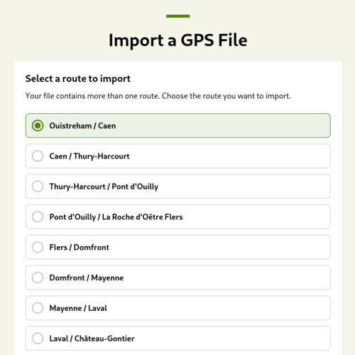

# Merge My GPX (MMG)

## Why this tool?

Have you ever downloaded a GPX file just to face something like this when you tried to import it in Komoot (and another platform)? 



This example is from the planner of La Vélo Francette (a bike road from Normandy to the Atlantic Ocean, in France). Instead of a single track that goes from start to finish, the GPX file has one track per stage. Consequence: you cannot import your trip as once and you cannot get a single route in your GPS unit to navigate.

Back in 2023, I was planning a long tour in Bourgogne, France, and I found myself juggling several GPX files — some with multiple tracks, one even going in the wrong direction. That’s when I created the first version of MMG: a tool to generate a single, clean GPX file that Komoot and friends can handle easily.

I know I’m not the only one who’s struggled to get a single, usable track when planning a long ride — so here’s this tool :)

## Usage

```raw
$ mmg --help
MMG - A tool to merge GPX files

Usage: merge-my-gpx [OPTIONS] <COMMAND>

Commands:
  merge       Merge all tracks from all given files into a file with a single track
  merge-all   Same as the "merge" command with all the files in the given directory
  invert      Invert each track of each given file
  invert-all  Same as the "invert" command with all the files in the given directory
  decimate    Decimate the points of each (segment of each) track, to reduce the size of a or more files
  info        Print information about one or more GPX files
  help        Print this message or the help of the given subcommand(s)
```

You can for instance do:

```bash
$ mmg invert c.gpx
$ mmg merge a.gpx b.gpx c-inverted.gpx d.gpx
```

You will get merged.gpx and it will contain a single track that goes from the start of `a` to the end of `d`.

## Future (possible) development

- When calling the `merge-all` command, the presence of `merged.gpx` in the directory is probably an issue.
    - It probably means that the command has been called several times on the same directory.
    - Merging again will result in a wrong file (the track will be made twice).
    - Solution?
        - Exclude file and overwrite
        - Abort
        - Ask user
- If `merge` is called with a single file, we may use a more precise name than just `merged.gpx`
- Add `--smart` option to `merge` and `merge-all` to try to guess the order of the files when merging.
